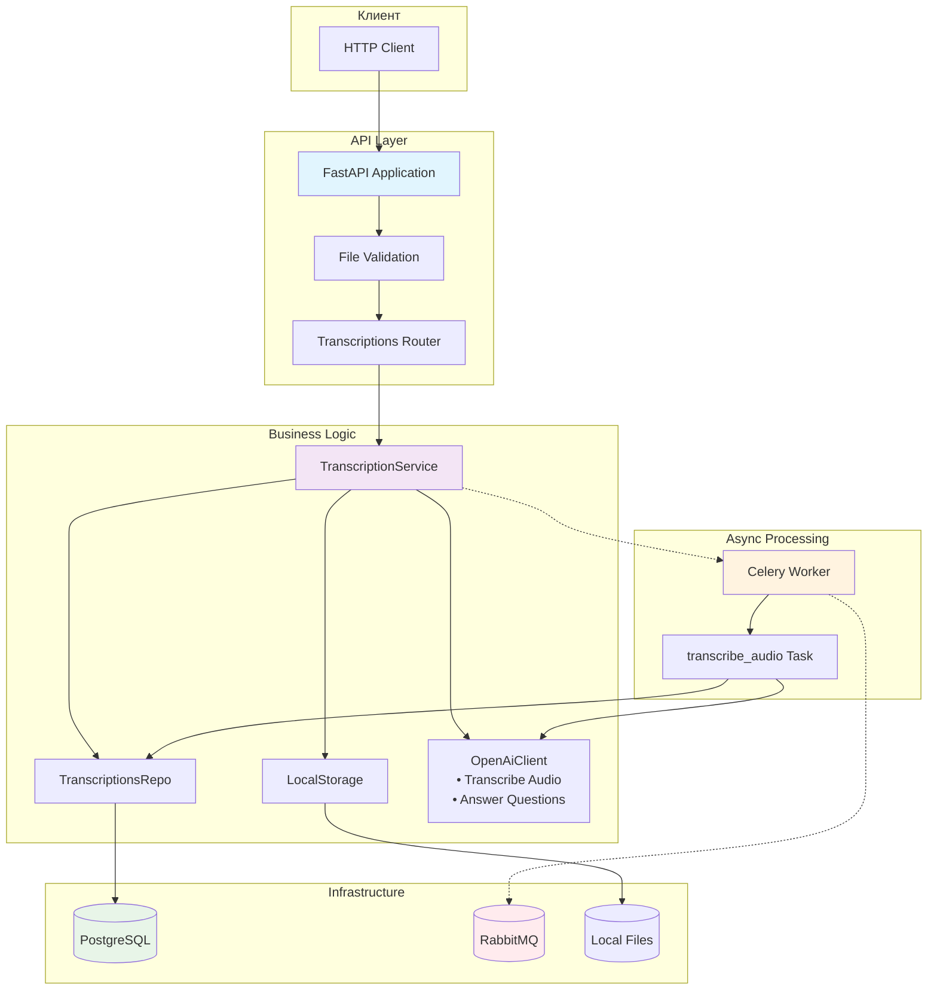
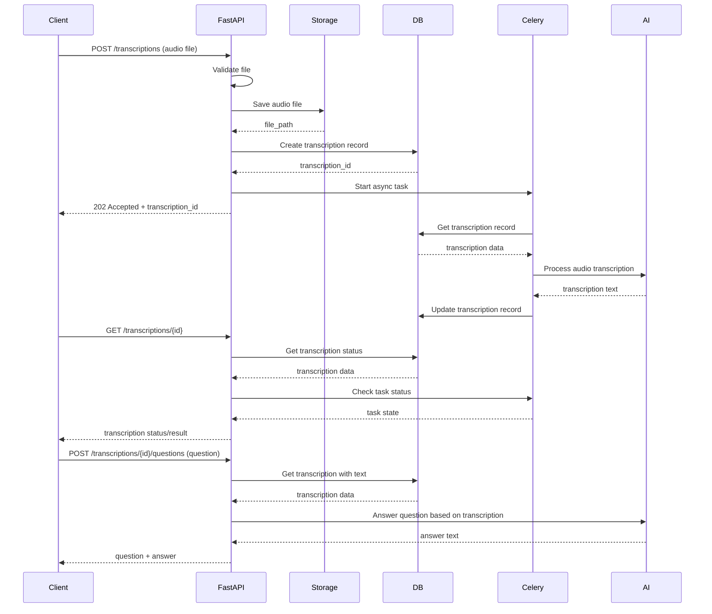
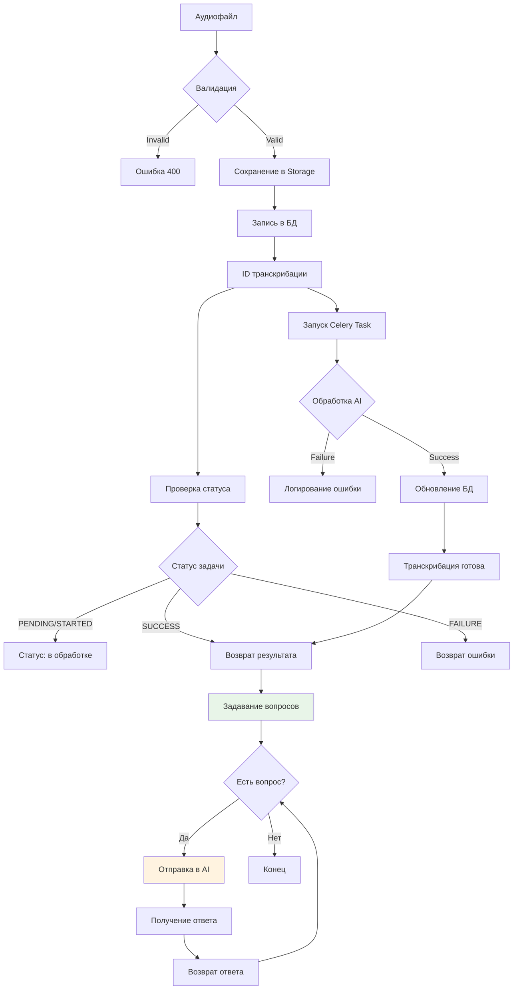

# Архитектура приложения

## Диаграмма компонентов системы

## Процесс обработки транскрибации

## Диаграмма потоков данных

См. также: [Обзор проекта](README.md), [API Endpoints](api-endpoints.md)
